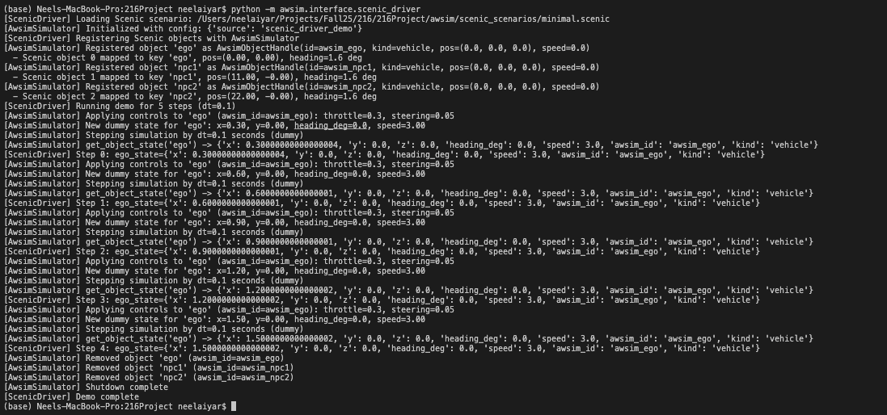

# AWSIM Subdirectory - Scenic Integration

This README documents only the `awsim/` subdirectory, which contains
the full Scenic → AWSIM mock integration used in the CSE 216 project.

You do **not** need the rest of the repository to run this
prototype, only the `awsim/` folder and Python with Scenic installed.

------------------------------------------------------------------------

## 1. Requirements

-   **Python 3.10+**
-   **Scenic**

Install Scenic:

``` bash
pip install scenic
```

I used `venv`.

------------------------------------------------------------------------

## 2. Directory Structure

``` text
awsim/
├── interface/
│   ├── scenic_driver.py        # Scenic → simulator bridge
│   └── awsim_simulator.py      # Mock AWSIM simulator
│
├── scenic_scenarios/
│   └── minimal.scenic          # Minimal multi-vehicle scenario
│
└── tests/
    ├── test_scenic_driver.py
    └── test_awsim_simulator.py
```

------------------------------------------------------------------------

## 3. Running the Minimal Demo

From the **repository root** that contains the `awsim/` folder:

``` bash
python -m awsim.interface.scenic_driver
```

------------------------------------------------------------------------

## 4. What the Demo Does

1.  Loads:

    ``` text
    awsim/scenic_scenarios/minimal.scenic
    ```

2.  Samples a Scenic scene containing:

    -   One **ego vehicle** at the origin
    -   Two **NPC vehicles** positioned behind the ego

3.  Registers each Scenic object into the simulator:

    -   `ego`
    -   `npc1`
    -   `npc2`

4.  Runs a short simulation loop (\~5 steps):

    -   Applies simple throttle + steer controls to the ego
    -   Updates all vehicle states using dummy kinematics
    -   Logs ego state each step

5.  Shuts down the simulator and removes all objects

------------------------------------------------------------------------

## 5. Expected Terminal Output

You should see:

-   Vehicles being registered into the simulator
-   Step-by-step ego vehicle state updates
-   Clean object removal and simulator shutdown



------------------------------------------------------------------------

## 6. Tests

Run from the **repository root**:

``` bash
# Scenic driver import / wiring test
python -m awsim.tests.test_scenic_driver

# AWSIM mock simulator test
python -m awsim.tests.test_awsim_simulator
```

### These Tests Verify

-   Scenic driver loads and runs correctly
-   Simulator registers vehicles and steps without runtime errors

------------------------------------------------------------------------

## 7. Component Breakdown

### 7.1 Scenic Driver

**File:** `awsim/interface/scenic_driver.py`

**Key Functions:**

-   `load_scenic_scene(filename="minimal.scenic")`
    -   Loads a Scenic file and samples a scene
-   `register_scene_objects(sim, scene)`
    -   Assigns keys (`ego`, `npc1`, `npc2`, ...)
    -   Registers each object into the simulator
-   `simple_control_policy(step_index)`
    -   Provides throttle + steering commands
-   `run_minimal_demo(steps=5, dt=0.1)`
    -   Full execution pipeline:
        -   Load → Register → Step → Log → Shutdown

------------------------------------------------------------------------

### 7.2 AWSIM Mock Simulator

**File:** `awsim/interface/awsim_simulator.py`

#### AwsimObjectHandle

Stores:

-   ID + type:
    -   `scenic_name`, `awsim_id`, `kind`
-   Information for state:
    -   `x`, `y`, `z`, `heading_deg`, `speed`
-   Control state:
    -   `throttle`, `steering`

#### AwsimSimulator

-   `register_object(key, kind="vehicle", scenic_obj=None)`
-   `step(dt, controls)`
-   `get_object_state(key)`
-   `remove_object(key)`
-   `shutdown()`

> This is a **pure Python mock simulator** meant to later be replaced by real
> AWSIM + ROS2 communication.

------------------------------------------------------------------------

### 7.3 Scenic Scenario

**File:** `awsim/scenic_scenarios/minimal.scenic`

Defines:

-   One ego vehicle at `(0, 0)`
-   Two NPC vehicles behind the ego
-   Shared heading + forward motion

Used to validate:

-   Scene sampling
-   Multi-agent registration
-   Control + state propagation

------------------------------------------------------------------------

## 8. Purpose of This Subsystem

This `awsim/` folder serves as:

-   A **proof-of-concept bridge** between Scenic and a simulator
-   A **test harness** for future AWSIM + Autoware integration
-   A **clean architectural scaffold** for ROS2-based expansion

------------------------------------------------------------------------

## 9. Planned Upgrades

-   Replace mock simulator with **real AWSIM via ROS2 topics**
-   Integrate **Autoware vehicle stack**
-   Support:
    -   Obstacles
    -   Intersections
    -   Parameterized multi-agent Scenic scenarios
-   Log closed-loop behavior under Autoware control

------------------------------------------------------------------------

## 10. Academic Usage

This subsystem supports:

-   **CSE 216 final project**
-   Research into:
    -   Simulation-driven testing
    -   Formal + generative scenario validation
    -   Autonomy system robustness

------------------------------------------------------------------------
